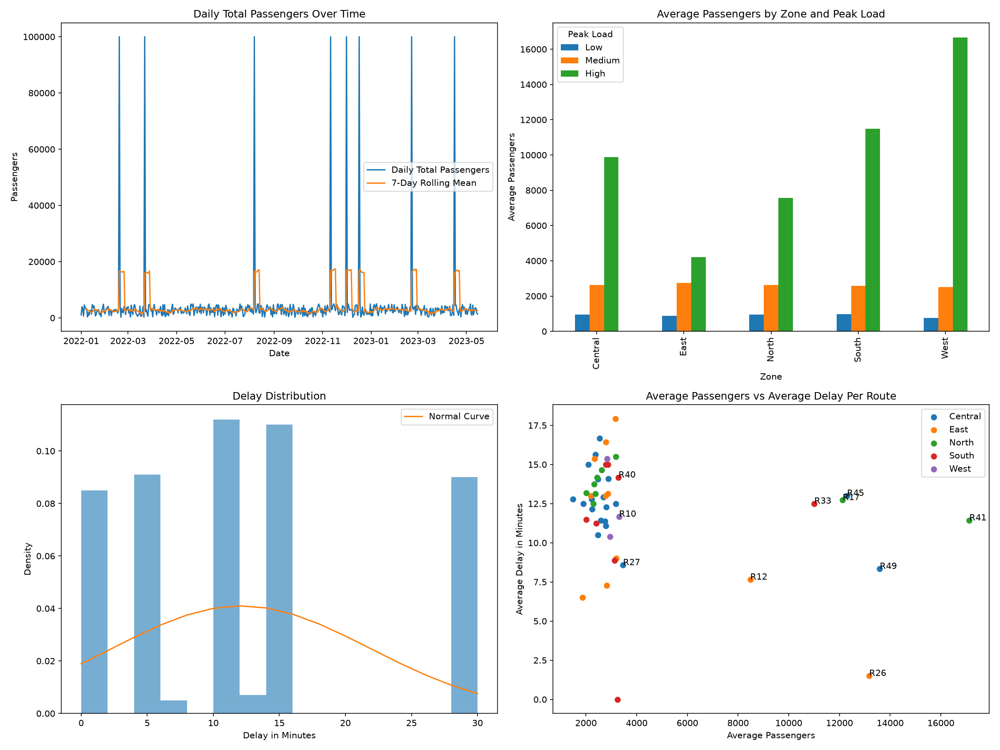

#  Urban Mobility Analytics Dashboard

A comprehensive Python Data Science solution for analyzing urban transit systems, detecting congestion patterns, and optimizing route efficiency using ETL, statistical analysis, and interactive visualization.

**Hackathon:** Set A - Python Data Science Hackathon

---

##  Dashboard Preview



*Multi-panel statistical visualization showing daily passenger trends, zone-based peak loads, delay distributions, and route efficiency metrics.*

---

##  Interactive Zone Map

Explore the interactive mobility heatmap with zone-level insights:

 **[View City Mobility Map](./city_mobility_map.html)** — Click to open the Folium-based interactive map showing real-time zone analytics, passenger density heatmaps, and delay hotspots.

**Map Features:**
- **Zone Markers:** Color-coded circles (Green = Low congestion, Orange = Medium, Red = High)
- **Heatmap Layer:** Real-time passenger density visualization
- **Popup Analytics:** Zone-level average passengers, delays, and peak load classification
- **Interactive Zoom:** Pan and zoom to inspect specific routes and areas

---

##  Files Included

| File | Purpose |
|------|---------|
| `app.py` | Streamlit dashboard application (main deliverable) |
| `urban_mobility_analytics.ipynb` | Jupyter Notebook with step-by-step ETL and analysis |
| `requirements.txt` | Python dependencies |
| `cleaned_ridership.csv` | Processed transit ridership data (500 records) |
| `mobility_dashboard.png` | Statistical visualization snapshot |
| `city_mobility_map.html` | Interactive Folium map (standalone HTML) |

---

##  Tech Stack

- **Data Processing:** Pandas, NumPy
- **Visualization:** Matplotlib, Folium, Streamlit
- **Algorithm:** Merge Sort (for route efficiency ranking)
- **Deployment:** Streamlit Community Cloud compatible

---

##  Quick Start

### Option 1: Run Streamlit App (Recommended)

```bash
# Install dependencies
pip install -r requirements.txt

# Launch the dashboard
streamlit run app.py
```

The app opens automatically at `http://localhost:8501`

---

### Option 2: Run Jupyter Notebook

```bash
# Install with Jupyter
pip install -r requirements.txt jupyter

# Launch notebook server
jupyter notebook

# Open and run: urban_mobility_analytics.ipynb
```

---

### Option 3: View Interactive Map Offline

Simply open `city_mobility_map.html` in your web browser to explore the zone-based analytics without running any Python code.

---

##  Deploy on Streamlit Cloud

1. **Push to GitHub:**
   ```bash
   git push origin main
   ```

2. **Deploy:**
   - Visit [share.streamlit.io](https://share.streamlit.io/)
   - Log in with your GitHub account
   - Click **"New app"** → Select this repository
   - Set **Main file path** to `app.py`
   - Click **"Deploy"**

3. Your dashboard will be live in minutes with a shareable public URL!

---

##  What This Dashboard Does

### 1. **ETL Pipeline**
- Handles missing values (median imputation by route)
- Detects and caps outliers (3σ rule + p99 normalization)
- Standardizes categorical data (zones, route IDs)
- Generates peak load classifications (Low/Medium/High)

### 2. **Route Efficiency Ranking**
- Calculates efficiency score: `passengers / (1 + delay)`
- Uses **Merge Sort algorithm** (O(n log n)) for ranking
- Identifies top 5 and bottom 5 performing routes
- Actionable insights for route optimization

### 3. **Statistical Analysis**
- Daily passenger trends with 7-day rolling averages
- Zone-level peak load distribution
- Delay distribution with normal curve overlay
- Scatter plot: Passengers vs. Delay (with route labels)

### 4. **Interactive Mapping**
- Zone markers with real-time color coding
- Heatmap overlay for passenger density
- Popup details: avg passengers, avg delay, peak load type
- Geographic coordinates for Delhi transit zones

---

##  Key Metrics

| Metric | Calculation |
|--------|-------------|
| **Efficiency Score** | `Avg Passengers / (1 + Avg Delay)` |
| **Peak Load** | Passenger count binned into 3 categories |
| **Rolling Average** | 7-day moving average (smoothing) |
| **Delay Distribution** | Histogram with normal curve fit |

---

##  Use Cases

- **Transit Planners:** Identify bottleneck routes and congestion zones
- **Operations Teams:** Optimize scheduling and resource allocation
- **Urban Analysts:** Monitor mobility trends and anomalies
- **Policy Makers:** Data-driven decisions for infrastructure investment

---

##  Data Schema

```
Dataset: 500 transit records (2022-01-01 onwards)

Columns:
├── route_id (str)      — Route identifier (R01–R50)
├── date (datetime)     — Recording date
├── passengers (float)  — Cleaned passenger count
├── delay_min (float)   — Average delay in minutes
├── zone (str)          — Geographic zone (North/South/East/West/Central)
├── peak_load (cat)     — Classification (Low/Medium/High)
└── day_of_week (str)   — Day name (for trend analysis)
```

---

##  Customization

**To analyze different zones:**
```python
# Edit ZONE_COORDS in app.py (lines 190–196)
ZONE_COORDS = {
    'North': [28.8000, 77.2090],
    'South': [28.4595, 77.0266],
    # Add your zones...
}
```

**To adjust peak load thresholds:**
```python
# Edit bins in clean_data() function (lines 65–69)
df['peak_load'] = pd.cut(
    df['passengers'],
    bins=[-np.inf, 1500, 3500, np.inf],  # Adjust these values
    labels=['Low', 'Medium', 'High']
)
```

---

##  Resources

- [Streamlit Documentation](https://docs.streamlit.io/)
- [Folium for Geospatial Visualization](https://python-visualization.github.io/folium/)
- [Pandas Data Cleaning Guide](https://pandas.pydata.org/docs/)

---

##  Team

**Hackathon:** Urban Mobility Analytics – Set A  
**Contributors:** Data Science Team  
**Date:** 2024

---

##  License

Open source for educational and research purposes.

---

##  Troubleshooting

| Issue | Solution |
|-------|----------|
| `ModuleNotFoundError` | Run `pip install -r requirements.txt` |
| Map won't load in Streamlit | Ensure `streamlit-folium` is installed |
| Slow performance | Reduce dataset size or use `@st.cache_data` decorator |

---
Made by 
Manish | Sivanesan | Rithish
